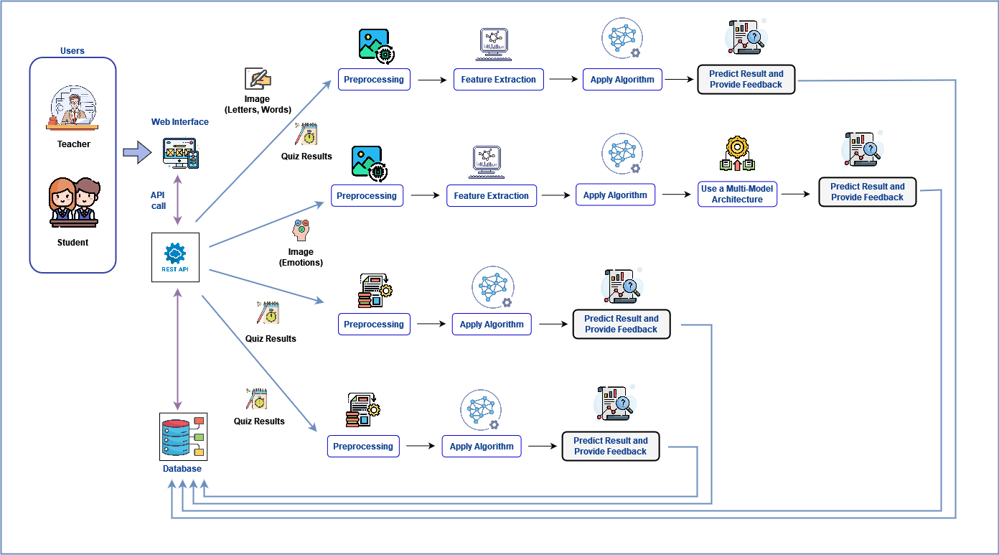

# 24-25J-230

# DiverseMind: An Integrated Framework for Children with Multi-Dimensional Learning Disabilities  🙋‍♂📚📝

## 👥Team  Members

### Group Leader: IT21295492 - Jayasundara J.M.H.H. - it21295492@my.sliit.lk

### Member 1: IT21302930 - Neewin S.L. - it21302930@my.sliit.lk

### Member 2: IT21298158 - Kiriwaththuduwa K.C.N - it21298158@my.sliit.lk

### Member 3: IT21217654 - Herath H.M.R.M.K. - it21217654@my.sliit.lk

## Overview

DiverseMind is a web-based educational platform designed to detect and support primary school children aged 9–10 years with learning difficulties. By utilizing advanced technologies like image processing, machine learning, and gamification, this system aims to identify the difficulties of the students and provide engaging, interventions that enhance students' skills and confidence in writing, attention span, mathematical abilities, and short-term memory.

## Problem Statement

In Sri Lanka, many primary school children with learning difficulties remain undetected at early stages due to a lack of personalized attention in classrooms. Without early intervention, these children often face increasing academic challenges, leading to diminished confidence and future unemployment.

## Purpose

The DiverseMind platform is developed to:

Identify slow learners through the analysis of their academic skills, particularly writing skills, attention span, mathamatical skills and short term memory. Provide personalized, gamified interventions aligned with the grade 4 syllabus and teacher's guide. Build the confidence and learning capabilities of slow learners through engaging activities.

## 📈 Overall System Diagram

## ✅ Components

### ✏ Identify Children with Writing Challenges and Provide Engaging Activities to Enhance Their Writing Skills (Jayasundara J.M.H.H.)
    ✔️ Identification of children with writing difficulties using ML|DL techniques.
        - Letter formation test.
        - Vowel symbol test.
        - Punctuation test.
    ✔️ Provide real-time feedbacks.
    ✔️ Provide interventions to improve writing skills.
    ✔️ Report Generation.

### 🧑‍💻 Identifying of the attention level and providing intervention to Enhance Attention Span (Neewin S.L.)
    ✔️ Identify slow learners facing attention level problems.
        - Facial Landmark detection.
        - Eye blink rate detection.
        - Eye gaze estimation.
        - Head pose estimation.
        - Calculate average attention score.
    ✔️ Provide real-time feedbacks.
    ✔️ Provide interventions to improve attention.
    ✔️ Report Generation.

### 📐 Identifying Slow Learners by Assessing Mathematical Abilities and Provide Engaging Activities to Enhance Their Mathematic Skills (Kiriwaththuduwa K.C.N)
    ✔️ Identify slow learners facing mathematical difficulties.
        - Addition.
        - Substration.
        - Multiplication.
        - Division.
        - Fractions.
    ✔️ Provide real-time feedbacks.
    ✔️ Provide personalized activities to enhance their mathematical skills.
    ✔️ Report Generation.

### 🧠 Identifying Slow Learners through Working Memory Assessment and Enhancing Their Working Memory
    ✔️ Identify slow learners from their working memory using machine learning.
    ✔️ Provide real-time feedbacks.
    ✔️ Provide gamified activities using teachers guide to improve their working memory.
    ✔️ Report Generation.

## Dependencies

### **Frontend** 🌐
- **Framework**: React.js ⚛️  
- **Styling**: Tailwind CSS
- **Libraries**: Axios, React Router, React Icons  

### **Backend** 🛠️
- **Framework**: FastAPI (Python-based API framework)

### **Database** 🗄️
- **Database**: MongoDB 🍃 (for data storage)  
- **Object Modeling Tool**: Mongoose  

### **Machine Learning** 🤖
- **Framework**: TensorFlow  
- **Libraries**: Scikit-learn, Pandas, NumPy  

### **Other Tools** 🧰
- **Image Processing**: OpenCV  
- **Deployment**: Docker 🐳  

    

